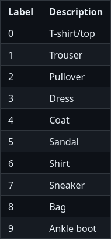

Data preprocessing
==================

First things first, we need to load our dataset and transform our data in a way we can use it. Let's talk about our dataset.

`fashion MNIST <https://github.com/zalandoresearch/fashion-mnist>`_ is a dataset provided by Zalando brand R&D team. It is split into two sets :
a training set of 60,000 examples and a test set of 10,000 examples. Each example is a grayscale image of 28x28 pixels, with a class label (among 10), 
representing a Zalando's article.

   Description of the ten classes of the dataset (took from the `fashion-mnist` git repository).

Load dataset
------------

In order to use it, we will create a new file, here called `fashion_MNIST_dataset.py`, where define a loading method called
`load_dataset_FashionMNIST_with_standardization`. Luckily for us, Pytorch already have a built-in method for the loading of Fashion MNIST.

.. code-block:: python

    def load_dataset_FashionMNIST_with_standardization(dataset_path, valid_ratio=0.2, num_threads=4, batch_size=128):

        # Load the dataset for the training/validation sets
        train_valid_dataset = torchvision.datasets.FashionMNIST(
            root=dataset_path,
            train=True,
            transform=None,
            download=True,
        )

        # Load the test set
        test_dataset = torchvision.datasets.FashionMNIST(
            root=dataset_path,
            transform=None,
            train=False
        )

        # Split it into training and validation sets
        nb_train = int((1.0 - valid_ratio) * len(train_valid_dataset))
        nb_valid = int(valid_ratio * len(train_valid_dataset))
        train_dataset, valid_dataset = torch.utils.data.dataset.random_split(
            train_valid_dataset, [nb_train, nb_valid]
        )

.. important::

    The Fashion MNIST dataset is already split in two (training and test). So we have to keep the whole second one for the testing dataset and split the first in two
    for have a training and a validation dataset. In another scenario, you must likely split a whole dataset into three distinct parts.

.. note::

    We also precise the number of threads we want to use for CPU parallelism and the size of our batchs. A very little batch is sometime called `minibatch` 
    in the litterature.

For now, our samples are raw PIL image. However, Pytorch manipulate `tensors <https://pytorch.org/tutorials/beginner/introyt/tensors_deeper_tutorial.html>`_, so we 
need to convert our images to Pytorch tensors. For that, the first idea that come in mind is to apply a image-to-tensor transformation for each sample. It is what we
are going to do, wrapping our dataset inside a DataTransformer class which is already declared inside ``data_utils.py``.

.. code-block:: python

    train_dataset = DatasetTransformer(train_dataset, data_transforms)
    valid_dataset = DatasetTransformer(valid_dataset, data_transforms)
    test_dataset = DatasetTransformer(test_dataset, data_transforms)

But if we need many transformation, is a good  practice to pack our transformations together. Another good practice for machine learning is to normalize the inputs. 
Despite the fact that ``torch.to_tensor()`` method already normalize our data, we going to add a standardization transformation to our datasets. For standardiez our 
data, we need a mean and a variance. They can be extracted from our most representative set, i.e. the training dataset, by the following function added 
to ``data_utils.py``.

.. code-block:: python

    def compute_mean_std(loader):
    """
    Compute the mean over minibatches.

    :parameter loader: Dataloader on which to iterate.
    :type loader: torch.utils.data.DataLoader.
    """

    mean_img = None
    for imgs, _ in loader:
        if mean_img is None:
            mean_img = torch.zeros_like(imgs[0])
        mean_img += imgs.sum(dim=0)
    mean_img /= len(loader.dataset)

    # Compute the std over minibatches
    std_img = torch.zeros_like(mean_img)
    for imgs, _ in loader:
        std_img += ((imgs - mean_img) ** 2).sum(dim=0)
    std_img /= len(loader.dataset)
    std_img = torch.sqrt(std_img)

    # Set the variance of pixels with no variance to 1
    # Because there is no variance
    # these pixels will anyway have no impact on the final decision
    std_img[std_img == 0] = 1

    return mean_img, std_img

It is now possible to compose our transformations and apply them for each sample.

.. code-block:: python

    ## NORMALISATION
    # Loading the dataset is using 4 CPU threads
    # Using minibatches of 128 samples, except for the last that can be smaller.

    normalizing_dataset = DatasetTransformer(train_dataset, transforms.ToTensor())
    normalizing_loader = torch.utils.data.DataLoader(
        dataset=normalizing_dataset, batch_size=batch_size, num_workers=num_threads
    )

    # Compute mean and variance from the training set
    mean_train_tensor, std_train_tensor = compute_mean_std(normalizing_loader)

    data_transforms = transforms.Compose([
        transforms.ToTensor(),
        transforms.Lambda(lambda x: (x - mean_train_tensor) / std_train_tensor),
    ])

    train_dataset = DatasetTransformer(train_dataset, data_transforms)
    valid_dataset = DatasetTransformer(valid_dataset, data_transforms)
    test_dataset = DatasetTransformer(test_dataset, data_transforms)

Dataset to data loaders
-----------------------

A **dataloader** (see official Pytorch tutorial `here <https://pytorch.org/tutorials/beginner/basics/data_tutorial.html>`_) is a wrapper class that allows us to 
iterate through our examples (and also shuffle our data and define the size of the batches we use). This class exist in Pytorch, so we can use it for create 
three loaders : one by dataset.

.. code-block:: python

    train_loader = torch.utils.data.DataLoader(
        dataset=train_dataset,
        batch_size=batch_size,
        shuffle=True,  # <-- this reshuffles the data at every epoch
        num_workers=num_threads,
    )

    valid_loader = torch.utils.data.DataLoader(
        dataset=valid_dataset,
        batch_size=batch_size,
        shuffle=False,
        num_workers=num_threads,
    )

    test_loader = torch.utils.data.DataLoader(
        dataset=test_dataset,
        batch_size=batch_size,
        shuffle=False,
        num_workers=num_threads,
    )

Finaly, we returns theses three loaders.
