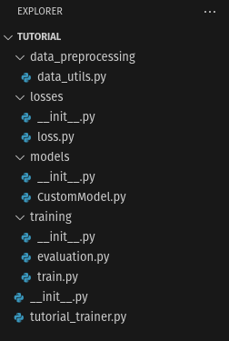

Getting started
===============

For this tutorial, we will only focuses in the implementation of the fully connected part of Jeremy Fix's `tutorial 
<https://teaching.pages.centralesupelec.fr/deeplearning-lectures-build/00-pytorch-fashionMnist.html>`_.
In this page, we gonna see how generate the project and the role of each file.

Project generation
------------------

First, we need to generate an empty JAW project.

.. code-block:: bash

    python3 src/jaw/JAWProject.py

Enter the name of your project and where save it.

.. warning::
    Use an absolute path for your project filepath.

You will have this result:

.. code-block:: bash

    yvregon@nostradamus:~/JAW$ python3 src/jaw/JAWProject.py 
    Enter a project name : tutorial
    Enter a root folder (default : /home/yvregon/JAW) :                   
    New JAW project generated.

And the following structure:

   Our project structure.

File tree
---------

For now, you will have a tree file like this :

| project_name
| ├── data_preprocessing
| │   └── data_utils.py
| ├── losses
| │   └── loss.py
| ├── models
| │   └── CustomModel.py
| ├── training
| │   ├── evaluation.py
| │   └── train.py
| └── project_name_trainer.py
| 
| 

Let's have a closer look to this folder structure:

- ``project_name`` is the root of our project.
- ``data_preprocessing`` is where we put our code for everything related to the data preprocessing, such as dataset transformer or splitting method.
- ``losses`` and ``models`` are the folder where put our custom network models and loss classes.
- The ``training`` folder contain our functions that handle training and evaluation loops.
- ``project_name_trainer.py`` is our "main" script: it's here where we define our training process and launch options.

.. tip::
    The project generation script produce automatic reStructuredText docstring, but you can also generate the same Sphinx documentation using a more readable 
    docstring with `napoleon <https://sphinxcontrib-napoleon.readthedocs.io/en/latest/>`_ extention (used by **numpy** for instance).
