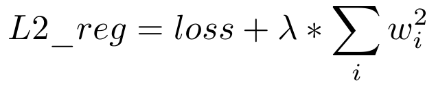

Model
=====

Here we are, the definition of our network's model!

First model
-----------

Almost all the function we need is already existant inside the Pytorch library, but it's a very low level (compared to some other) library, so we will add a little 
method for getting a simple ReLU layer.

.. code-block:: python

    def linear_relu(dim_in, dim_out):
    """
    Create a linear reLU layer.
    """

    return [nn.Linear(dim_in, dim_out), nn.ReLU(inplace=True)]

A good practice is to write all our custom model and related methods to the same file, as ``models/cutom_models.py`` for example. In the first time, we will only 
create a two hidden layers fully connected network, with 256 neurons per layer.

.. code-block:: python

    class FullyConnected(nn.Module):
    """
    Simple fully connected classification model.
    """

    def __init__(self, input_size, num_classes):
        super(FullyConnected, self).__init__()
        self.classifier = nn.Sequential(
            *linear_relu(input_size, 256),  # First hidden layer
            *linear_relu(256, 256),         # Second one
            nn.Linear(256, num_classes)
        )

    def forward(self, x):
        x = x.view(x.size()[0], -1)
        y = self.classifier(x)
        return y

The ``forward(x)`` method define the operation applied to our tensors when we made a inference with our model.

.. note::

    As usual, the class bodies are already generated with the JAW project.

Regularization
--------------

Let's see another more avanced example. We will **regularize** our previous model.

A **regularization** is a constraint imposed on the model during its training aimed at limiting overfitting. Another way of defining it is to say that we are trying 
to prefer a model simple to a complex, therefore maximizing the capacity for generalization. We can find here a more mathematical 
`definition <https://mlweb.loria.fr/book/en/regularization.html>`_.

Here we will use the L2 regularization. This technique aims to reduce the weights of the learned model proportionally to the sum of the squares of these same weights, 
according to the following formula:

